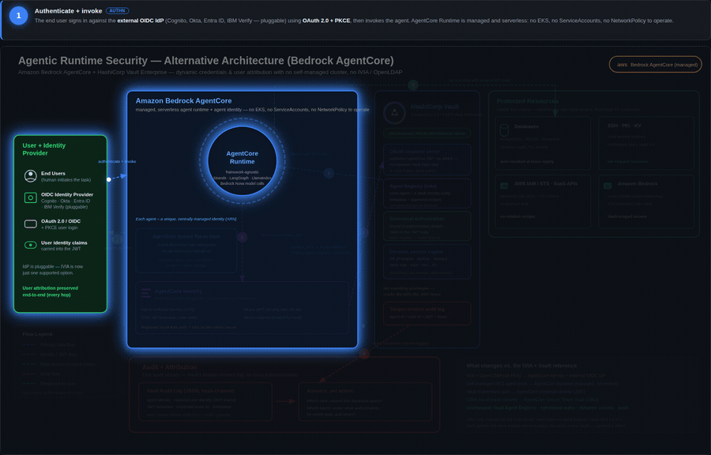

# Agent Workflow Skills

Three [Claude Code](https://code.claude.com) skills for building software: one that takes a change
from idea to released-and-verified, one that settles the design visually before any code gets
written, and one that turns a static diagram into a narrated step-through animation.

All three are **project-agnostic**. They read the conventions of whatever repo you're in — test
commands, deploy pipeline, release rules, design tokens — rather than assuming a stack. Nothing about
them is specific to the projects they grew out of.

Alongside them, this marketplace also carries a large [vendored collection](#the-vendored-collection)
— 111 agents and 499 skills gathered from the wider community, grouped so you can install a category
at a time.

> **Upgrading from an earlier install?** The marketplace and plugin layout changed — see
> [Upgrading](#upgrading-from-the-old-layout) before running anything.

## What's in here

Everything ships as a single plugin, `devopsoscar`, in the `claude-skills` marketplace.

| Skill | Invoke | What it does | Requires |
|---|---|---|---|
| **ship** | `/devopsoscar:ship` | Runs the whole lifecycle — discover, scope, issue, branch, TDD, PR, merge, migrate, release, verify — stopping at five consequential gates for your approval. | nothing |
| **design-mockup** | `/devopsoscar:design-mockup` | Generates on-brand UI mockups from your project's real design tokens, looks at every screenshot to check brand fidelity, and presents a review gallery before implementation. | [Stitch](https://stitch.withgoogle.com) MCP server |
| **diagram-animator** | `/devopsoscar:diagram-animator` | Turns an architecture or flow diagram into a self-contained animated walkthrough — each step draws its arrow, highlights the components involved, dims the rest, and narrates the mechanism. Exports GIF, MP4, MOV, and stills. | `ffmpeg` for video export |

You rarely type the slash command. All three trigger from what you ask for — "ship this fix", "mock
up the settings screen", "animate this diagram" — and the explicit form is there for when you want to
force it.

### ship

A single `/devopsoscar:ship` that auto-detects where the work already is and continues from there.
The value isn't the happy path — it's the failure modes baked in as guardrails:

- **Merged ≠ shipped.** For a versioned distributable (desktop app, CLI, library), merging ships
  nothing; users stay on the old version until a tagged release goes out and the distribution channel
  actually resolves it.
- **A built draft is not a released one.** Publishing, not building, is what reaches users.
- **A broken deploy hides a pending migration.** Un-run migrations pile up invisibly while deploys
  fail — then the merge that *fixes* the pipeline is what takes production down, blaming the wrong
  change.
- **Never hand-author DDL.** Schema changes go through the project's own tool, previewed first, and
  abort on any drop or type change.
- **Get the migration tool to the database**, not the database to your laptop — and verify a tunnel is
  even possible before assuming it.

It stops for you at five points: scope-lock, pre-PR, pre-merge, pre-release, and any production
migration. Between those it runs on its own.

### design-mockup

Mockup-first: decide and approve the design visually before implementation. It finds your project's
actual design source of truth (a style guide, design tokens, a Tailwind/theme config, a live design
system page), extracts the real hex values rather than inventing a brand, generates one screen to
verify, then batches the rest. Every screenshot is downloaded and actually viewed — a wrong-looking
screen is something no test suite can catch.

### diagram-animator



Static architecture diagrams show *what exists*. They're bad at showing *what happens*, because every
arrow is drawn at once and the reader has no idea where to start. This turns one into a sequenced
walkthrough: step by step, the relevant arrow draws itself, the components involved light up,
everything else recedes to 10% opacity, and a caption explains the mechanism.

Output is a single self-contained HTML file — no build step for the viewer, no external requests,
works offline, survives being emailed. It takes SVG directly, Mermaid and Graphviz via a render step,
and falls back to a spotlight overlay for raster diagrams.

The animation is modelled as a pure function of a timeline position, which is what makes deterministic
frame export possible: GIF for Slack and READMEs, MP4 for decks, MOV for QuickTime and Keynote,
ProRes for anything that gets re-edited, and per-step PNGs for slides.

The per-diagram work is grouping the SVG into layers and writing the captions. The engine is written
once and reused, so the second diagram is much cheaper than the first.

## Install

**Prerequisite:** [Claude Code](https://code.claude.com) installed. `ship` and `diagram-animator`
need nothing else to produce their main output. `diagram-animator` additionally wants `ffmpeg` on
`PATH` for GIF/MP4/MOV export — without it the HTML and PNG stills still work. `design-mockup`
requires the Stitch MCP server — see below.

Register the marketplace once, then install the plugin. From inside a Claude Code session:

```
/plugin marketplace add sharepointoscar/agent-workflow-skills
/plugin install devopsoscar@claude-skills --scope user
```

Or from your terminal, which works the same way:

```bash
claude plugin marketplace add sharepointoscar/agent-workflow-skills
claude plugin install devopsoscar@claude-skills --scope user
```

`--scope user` makes the skills available in every project on that machine. Drop it to install for
the current project only.

The marketplace is named `claude-skills`; the repo it lives in is `agent-workflow-skills`. You add the
marketplace by *repo*, and install from it by *marketplace name* — hence the two different names in
those two commands.

### Setting up Stitch (design-mockup only)

`design-mockup` drives [Stitch](https://stitch.withgoogle.com), Google's design-to-code tool, over
MCP. Get an API key from your Stitch account, then register the server:

```bash
claude mcp add --transport http stitch https://stitch.googleapis.com/mcp \
  --header "X-Goog-Api-Key: YOUR_STITCH_API_KEY"
```

Add `--scope user` to make it available in every project on that machine.

Verify it connected:

```bash
claude mcp list
```

`stitch` should appear as connected. Without it, the `design-mockup` skill still installs but cannot
generate anything — the `mcp__stitch__*` tools it depends on won't exist.

### Verify it worked

```bash
claude plugin list
```

`devopsoscar` should appear as `enabled` at `user` scope. Start a new session and type
`/devopsoscar:` — all three skills should offer themselves.

### Update

```bash
claude plugin marketplace update claude-skills
```

Auto-update is off by default for third-party marketplaces. Turn it on per machine under `/plugin` →
Marketplaces if you'd rather not update by hand.

### Uninstall

```bash
claude plugin uninstall devopsoscar@claude-skills
```

## The vendored collection

Separately from the three skills above, this marketplace carries **111 agents and 499 skills**
collected by [MK-ORGANIZATION-1/AGENTS-COLLECTION](https://github.com/MK-ORGANIZATION-1/AGENTS-COLLECTION),
which is itself an aggregation of around fifteen community sources. They live here so they can be
versioned and edited rather than copied loose into `~/.claude/`, where nothing tracks them and every
edit is lost on the next re-copy. See [NOTICE](NOTICE) for provenance — that upstream repo publishes
no licence, and the MIT licence here does not extend to it.

**Read this before installing all of them.** Enabling every group at once adds roughly **76,000
tokens to every session, in every project**, because each agent and skill puts its name and
description in context whether or not the task is related. That is the whole reason they are twenty
plugins instead of one: enable the two or three you actually use.

| Plugin | Holds | Always-on cost |
|---|---|---|
| `agents-engineering` | 25 agents — backend/frontend architects, AI and data engineers, DevOps, mobile, prototyping, security, and single-purpose architecture/codegen/CI/docs/repo-scan agents | ~4,592 |
| `agents-testing` | 14 agents — API testing, accessibility auditing, benchmarking, test writing and fixing, results analysis, tool evaluation | ~4,616 |
| `agents-support-ops` | 15 agents — support response, analytics and exec reporting, finance, infrastructure, legal and compliance, data extraction | ~3,865 |
| `agents-design` | 13 agents — brand, UI and UX design, UX research, visual storytelling, image prompting, inclusive visuals | ~3,721 |
| `agents-project-management` | 10 agents — experiment tracking, shepherding, studio ops and production, shipping, an orchestrator | ~3,356 |
| `agents-marketing` | 18 agents — content, growth, ASO, and per-channel specialists including WeChat, Xiaohongshu and Zhihu | ~2,439 |
| `agents-product` | 7 agents — sprint prioritisation, feedback synthesis, trend research, behavioural nudges | ~2,172 |
| `agents-specialized` | 4 agents — agentic identity and trust, cultural intelligence, developer advocacy, a joker | ~521 |
| `agents-xr-spatial` | 5 agents — XR interfaces and cockpits, immersive dev, visionOS, macOS Metal | ~240 |
| `skills-azure-m365` | 69 skills — the Azure SDKs across .NET, Java, Python, TypeScript and Rust, plus M365 agents | ~10,629 |
| `skills-data-ai` | 72 skills — data engineering, databases, RAG and embeddings, LLM patterns and evaluation, prompting, agent memory | ~6,078 |
| `skills-devex` | 77 skills — git and PR workflows, TDD, debugging, refactoring, code review, planning, worktrees | ~5,732 |
| `skills-integrations` | 57 skills — Slack, Jira, Notion, Salesforce, Stripe, Zapier and the rest of the automation set | ~5,326 |
| `skills-cloud-infra` | 47 skills — AWS and GCP, Kubernetes, Terraform, Helm, Docker, observability, deployment, incident response | ~4,521 |
| `skills-languages` | 43 skills — the per-language depth skills and their frameworks | ~4,231 |
| `skills-business` | 40 skills — SEO, paid ads, pricing, launch, startup analysis, product, HR, support | ~4,176 |
| `skills-security` | 38 skills — penetration testing, web vulnerability classes, threat modelling, SAST, secrets, forensics | ~3,886 |
| `skills-web-frontend` | 33 skills — React, Next.js, Angular, design systems, accessibility, web performance | ~3,415 |
| `skills-misc` | 11 skills — the ones that fit nowhere cleanly | ~1,111 |
| `skills-content-docs` | 12 skills — documentation, wikis, tutorials, Mermaid, Office formats, publishing | ~1,109 |

Install a group, then enable it — they install **disabled** on purpose, so nothing lands in your
context until you say so:

```bash
claude plugin install agents-engineering@claude-skills --scope user
claude plugin enable agents-engineering@claude-skills
```

Turning one back off costs nothing and keeps it installed:

```bash
claude plugin disable agents-engineering@claude-skills
```

Agents from these plugins are namespaced, so they are dispatched as
`agents-engineering:backend-architect`, and skills as `/skills-devex:systematic-debugging`.

### Two things that look wrong and aren't

**33 of the agents are the same role twice** — `brand-guardian` and `design-brand-guardian`,
`ai-engineer` and `engineering-ai-engineer`. Upstream merged two collections that both cover the
ground, and the two takes are genuinely different documents written to different templates. Both are
kept, under distinct names, in the same plugin. Neither is obviously the better one, so picking for
you would have been a guess.

**18 upstream files are not here at all.** The phase playbooks, scenario runbooks, handoff templates
and the NEXUS strategy document are prose about how to run a multi-agent pipeline — they are not
agents and cannot be installed as any. They stayed upstream.

### Re-vendoring

`scripts/vendor-collection.mjs` regenerates every `agents-*` and `skills-*` plugin from a checkout of
upstream, and is the complete record of what was changed on the way in. It never touches
`plugins/devopsoscar`.

```bash
git clone --depth 1 https://github.com/MK-ORGANIZATION-1/AGENTS-COLLECTION.git /tmp/collection
node scripts/vendor-collection.mjs /tmp/collection
```

It fails loudly rather than dropping anything: an agent matching no category, or two skill
directories colliding when lowercased, stops the run.

Edits you make by hand inside a generated plugin are overwritten by the next run. To keep a change,
put it in the script — or move the file into `plugins/devopsoscar`, which the script leaves alone.

## Upgrading from the old layout

Earlier versions of this repo published a marketplace named `agent-workflow-skills` containing two
separate plugins, `ship` and `design-mockup` — invoked as `/ship:ship` and
`/design-mockup:design-mockup`. Both are now skills inside one plugin, `devopsoscar`, in a marketplace
named `claude-skills`.

The doubled `/x:x` was the reason: a slash command is `/<plugin>:<skill>`, so naming a plugin after
its only skill repeats the word. Plugin names are now categories and skill names are actions.

Nothing migrates automatically. Remove the old install first, or you'll have two copies of each skill
competing to trigger:

```bash
claude plugin uninstall ship@agent-workflow-skills
claude plugin uninstall design-mockup@agent-workflow-skills
claude plugin marketplace remove agent-workflow-skills

claude plugin marketplace add sharepointoscar/agent-workflow-skills
claude plugin install devopsoscar@claude-skills --scope user
```

Your muscle memory changes from `/ship` to `/devopsoscar:ship`. Description-based triggering is
unaffected — asking Claude to "ship this" works exactly as it did.

## Using them across machines

Run the install commands on each machine — that's the whole sync mechanism. Edit a skill in this
repo, commit, push, then `claude plugin marketplace update claude-skills` everywhere else.

Keeping a second hand-edited copy in `~/.claude/skills/` alongside the installed plugin will silently
drift. Pick one source of truth; this repo is the intended one.

### Working on the skills themselves

Clone the repo, edit `plugins/devopsoscar/skills/<name>/SKILL.md`, and to try a change before
pushing:

```bash
claude --plugin-dir ./plugins/devopsoscar
```

### A note on context cost

Every enabled skill and agent puts its name and description in Claude's context in *every*
conversation, whether or not the task is related. The three `devopsoscar` skills are a few hundred
tokens — unnoticeable. The [vendored collection](#the-vendored-collection) is ~76,000 if you enable
all of it, which is why it ships as twenty separately-enabled plugins rather than one.

`claude plugin details <name>` prints what any plugin costs before you enable it, broken down per
agent and per skill.

## License

MIT for the `devopsoscar` plugin and the tooling in `scripts/`. The vendored `agents-*` and
`skills-*` plugins are third-party content under separate — and largely unstated — terms; see
[NOTICE](NOTICE).
